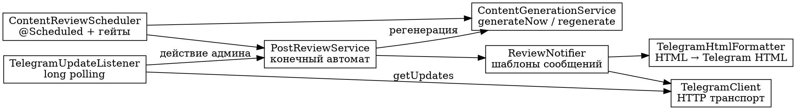
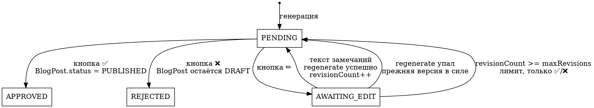

# Спек 1: Ядро ревью блог-постов через Telegram

**Дата:** 2026-08-12
**Статус:** на согласовании
**Место в общей картине:** первый из трёх спеков. Спек 2 — генерация картинки (YandexART). Спек 3 — постинг в канал + JSON-LD разметка.

## Цель

Пост генерируется по расписанию с настраиваемым кадансом, приходит админу в Telegram, админ с телефона одобряет / отклоняет / отправляет правки, одобренный пост публикуется на сайте.

Картинки и постинг в канал в этот спек **не входят**.

## Что уже работает и не переделывается

| Возможность | Где |
|---|---|
| Генерация статьи через YandexGPT, ретраи, детект обрезки, таймауты | `YandexGptService`, `ContentGenerationService:92-106` |
| Парсинг JSON из ответа модели с допуском на markdown-обёртки и лишнюю прозу | `ContentGenerationService.parseJsonPayload` |
| Ротация тем по принципу «наименее использованная» | `ContentGenerationService.pickTopic` |
| Санитизация модельного HTML через jsoup | `ContentGenerationService.ARTICLE_SAFELIST` |
| Уникальность slug с разрешением коллизий одним запросом | `ContentGenerationService.uniqueSlug` |
| Транслитерация кириллицы в slug | `SlugUtil` |
| Защита черновиков от анонимного чтения | `PremiumService:183`, `SecurityConfig:39` |
| Публичная выдача только опубликованных постов | `PremiumService.listPublishedBlogPosts` |

## Ключевое отклонение от исходного требования

**Ссылки на превью в сообщении не будет. Вместо неё в чат уходит полный текст статьи.**

Причина техническая и непреодолимая в рамках текущей архитектуры: cookie авторизации выставляется с `SameSite=Strict` (`Controller:54`). Переход по ссылке из Telegram — это кросс-сайтовая навигация, при которой браузер такую cookie **не отправляет**. Значит `isStaff()` в `PremiumService:183` вернёт `false`, и `GET /api/cms/blog/{slug}` ответит `404 Blog post not found` даже админу, который залогинен в CMS на том же телефоне.

Рассмотренная альтернатива — отдельный публичный endpoint превью с подписанным одноразовым токеном в URL. Отклонена: это новая поверхность атаки (токен доступа к неотревьюенному медицинскому контенту живёт в истории браузера и в логах), ради удобства, которое полный текст в чате и так обеспечивает.

Следствие: статья на 700–1000 слов это примерно 5000–7000 символов, а лимит одного сообщения Telegram — 4096. Текст разбивается на несколько сообщений, кнопки прикрепляются к последнему.

## Архитектура



Циклов в графе зависимостей нет. Это потребовало вынести `@Scheduled` из `ContentGenerationService` в отдельный `ContentReviewScheduler` — иначе получалось `ContentGenerationService → PostReviewService → ContentGenerationService`.

### Ответственности

**`ContentGenerationService`** (существующий, меняется). Чистая генерация, ничего не знает про Telegram и про ревью. Публичные методы: `generateNow()` — новая статья по выбранной теме; `regenerate(BlogPostEntity post, String instruction)` — перезапись существующей статьи по замечаниям. `@Scheduled` убирается.

**`ContentReviewScheduler`** (новый). Просыпается по cron, проверяет два гейта, запускает генерацию, отдаёт результат в ревью. Вся логика «когда пора» здесь и тестируется без обращения к модели.

**`PostReviewService`** (новый). Конечный автомат. Переходы состояний, идемпотентность, лимит ревизий. Зависит от `ContentGenerationService` и `ReviewNotifier`, но не от `TelegramClient` — то есть тестируется на моках без сети.

**`ReviewNotifier`** (новый). Знает, как выглядят сообщения: превью с кнопками, подтверждения, ошибки. Единственное место, где живут тексты для админа.

**`TelegramClient`** (новый). Тупой транспорт к Bot API: `sendMessage`, `editMessageReplyMarkup`, `answerCallbackQuery`, `getUpdates`. Про блог и ревью не знает ничего.

**`TelegramUpdateListener`** (новый). Фоновый цикл поллинга, фильтр по chat id админа, разбор апдейта, диспетчеризация.

**`TelegramHtmlFormatter`** (новый, `util`). Чистая функция: HTML статьи → список готовых к отправке кусков Telegram-HTML. Без зависимостей, полностью юнит-тестируется.

### Размещение по пакетам

Проект организован по слоям (`entity`, `repo`, `service`, `util`, `config`), и спек эту конвенцию сохраняет, а не вводит вторую схему рядом:

- `com.cms.entity` — `PostReviewEntity`, `ReviewState`
- `com.cms.repo` — `PostReviewRepository`
- `com.cms.service` — `TelegramClient`, `TelegramUpdateListener`, `PostReviewService`, `ReviewNotifier`, `ContentReviewScheduler`
- `com.cms.util` — `TelegramHtmlFormatter`

Конфигурация читается через `@Value` в конструкторах — так уже сделано в `YandexGptService` (7 параметров) и `ContentGenerationService`. Отдельный `@ConfigurationProperties`-класс не вводится.

Разбор JSON от Telegram — через `JsonNode`, как в `YandexGptService`, без DTO-классов на каждый тип апдейта.

## Модель данных

### `ReviewState`

```
PENDING        отправлено админу, ждём нажатия кнопки
AWAITING_EDIT  админ нажал «Правки», ждём текст замечаний
APPROVED       опубликовано (терминальное)
REJECTED       отклонено (терминальное)
```

Состояния `FAILED` нет намеренно: если регенерация не удалась, ревью возвращается в `PENDING` с прежней версией текста — админ всё ещё может её опубликовать или отклонить. Тупиковых состояний, блокирующих пайплайн, в автомате нет.

### `PostReviewEntity` (таблица `post_review`)

| Поле | Тип | Смысл |
|---|---|---|
| `id` | `Integer`, identity | |
| `blogPost` | `@OneToOne`, `blog_post_id` unique, not null | ревьюируемый пост |
| `state` | `ReviewState`, enum string, not null | |
| `telegramMessageId` | `Long`, nullable | id сообщения с кнопками; `null` пока не отправлено |
| `revisionCount` | `int`, not null, default 0 | сколько раз переписывали |
| `lastInstruction` | `TEXT`, nullable | последние замечания админа |
| `createdAt` / `updatedAt` | `LocalDateTime` | через `@PrePersist` / `@PreUpdate`, как в `BlogPostEntity` |

`PageStatus` (общий с `PageEntity`) **не меняется**. «Видно ли на сайте» и «где в пайплайне ревью» — ортогональные вещи; добавление в общий enum состояний ревью засорило бы `PageEntity` статусами, которые к нему не относятся.

Таблица создаётся Hibernate автоматически: `ddl-auto: update` (`application.yml:8`). Миграционного инструмента в проекте нет.

## Конечный автомат



**Идемпотентность обязательна.** Telegram повторяет доставку неподтверждённых апдейтов, а админ может дважды тапнуть кнопку. Каждый переход сначала проверяет текущее состояние; если оно не то, которое ожидается, действие игнорируется, а на callback отвечает «уже обработано». Дополнительно после любого действия клавиатура снимается через `editMessageReplyMarkup` с пустым `inline_keyboard` — чтобы кнопки физически нельзя было нажать повторно.

## Гейты запуска генерации

`ContentReviewScheduler` просыпается по `content.generation.cron` (по умолчанию 08:00 ежедневно — как сейчас) и проверяет по порядку:

1. **Выключено?** `content.generation.enabled == false` → выход. Поведение как сейчас.
2. **Есть незавершённое ревью?** Существует запись в состоянии `PENDING` или `AWAITING_EDIT` → выход. Один пост в ревью за раз, черновики не накапливаются.
   - **Исключение — самолечение:** если найденное `PENDING`-ревью имеет `telegramMessageId == null`, значит генерация прошла, а отправка в Telegram упала. Тогда планировщик не выходит, а повторяет отправку уведомления. Без этого одна сетевая ошибка заблокировала бы пайплайн навсегда.
3. **Интервал не прошёл?** `content.generation.interval-days` (1 / 3 / 7) сравнивается с числом полных суток с момента `createdAt` последнего AI-поста. Не прошло → выход.

**Почему не cron-выражение для каданса.** «Каждые 3 дня» в cron не выражается корректно: `0 0 8 */3 * *` означает «1, 4, 7 … 28, 31 число», и на стыке месяцев интервал ломается (31 → 1 даёт разрыв в одни сутки). Гейт по числу суток даёт точную семантику 1/3/7, не плывёт по месяцам и сам догоняет расписание, если контейнер лежал.

**Интервал считается от последней генерации, независимо от исхода.** Отклонённый пост тоже сдвигает отсчёт. Это предсказуемо и не даёт спамить админа ежедневно, если модель стабильно выдаёт плохой текст. Компенсируется командой `/generate`, которая форсирует запуск, минуя гейт интервала (но не гейт «один в ревью»).

## Отклонённые посты не сжигают тему

`findUsedTopics()` (`BlogPostRepository:28`) сейчас считает `sourceTopic` у всех постов. Отклонённый пост зачёлся бы как использованная тема, и она бы выпала из ротации — то есть админ отклонил плохую статью, а тема больше не появится.

Запрос дополняется исключением отклонённых:

```java
@Query("""
        select b.sourceTopic from BlogPostEntity b
        where b.sourceTopic is not null
          and not exists (
              select 1 from PostReviewEntity r
              where r.blogPost = b and r.state = com.cms.entity.ReviewState.REJECTED
          )
        order by b.id asc
        """)
List<String> findUsedTopics();
```

Сам отклонённый пост из базы **не удаляется**: остаётся в статусе `DRAFT` со связанным `REJECTED`-ревью. Это даёт историю того, что модель генерирует плохо, — по ней потом правится промпт.

## GEO: чего требуем от модели

Generative Engine Optimization — попадание в генеративные ответы (Яндекс Нейро, ChatGPT, Perplexity). Такие системы извлекают из статьи самодостаточные фрагменты, поэтому промпт переписывается под извлекаемость, а не только под ключевые слова.

Новый системный промпт `ContentGenerationService.systemPrompt()`:

```
Ты — медицинский копирайтер для сайта клиники.
Напиши статью для блога на 700–1000 слов.

СТРУКТУРА (от неё зависит попадание статьи в ответы поисковых AI):
- Первый абзац — прямой сжатый ответ на главный вопрос темы, 2–3 предложения.
  Начинай сразу с сути. Никаких «в современном мире», «как известно», «сегодня всё чаще».
- Подзаголовки <h2> формулируй как вопросы, которые люди задают вслух.
- Каждый раздел должен быть понятен сам по себе, без чтения предыдущих:
  не пиши «как сказано выше», «этот метод», «данный подход» — называй предмет явно.
- Абзацы короткие: 2–4 предложения.
- Где есть перечисление — <ul> или <ol>, а не сплошной текст.
- В конце раздел <h2>Частые вопросы</h2> и 3–5 пар:
  <h3>вопрос</h3><p>ответ в 1–3 предложения</p>.
- Самая последняя строка — фраза о необходимости очной консультации врача.

ЗАПРЕЩЕНО:
- Ставить диагнозы и назначать лечение.
- Выдумывать статистику, проценты, исследования, цитаты, имена врачей.
- Называть препараты и дозировки.
- Вода и общие рассуждения без конкретики.

Ответ верни строго в JSON формате, одним объектом:
{
  "title": "заголовок — вопрос или конкретное утверждение, до 70 символов",
  "body": "полный текст в HTML (h2, h3, p, ul, ol, li, strong, em)",
  "metaDescription": "мета-описание до 160 символов: прямой ответ, а не интрига",
  "keywords": "ключевые слова через запятую"
}

Не оборачивай ответ в markdown. Не добавляй текст до или после JSON.
Все кавычки внутри значений экранируй.
```

Требование «красиво написано» покрывается здесь же: короткие абзацы, списки, запрет воды и штампов, конкретика вместо общих рассуждений.

Контракт JSON не меняется — те же четыре поля, что и сейчас, поэтому `parseJsonPayload` и его тесты остаются в силе. Спек 3 добавит в этот же объект поле `telegramSummary` для анонса в канал.

`ARTICLE_SAFELIST` менять не нужно: `Safelist.relaxed()` уже разрешает `h2`, `h3`, `ul`, `ol`, `li`, `strong`, `em` и вырезает `img`.

### Промпт регенерации

```
Текущая версия статьи.
Заголовок: {title}
Текст: {body}

Замечания редактора: {instruction}

Перепиши статью целиком с учётом замечаний. Соблюдай все требования
к структуре и все запреты. Верни тот же JSON-объект.
```

**Slug при регенерации.** Заголовок меняется, и slug пересчитывается — пост ещё не опубликован, ссылок на него нет, а slug, соответствующий заголовку, лучше для SEO. Здесь есть ловушка: `uniqueSlug` смотрит `findSlugsStartingWith(base)` и **увидит собственный slug поста как занятый**, добавив бессмысленный суффикс `-1`. Поэтому: если новый базовый slug совпадает с текущим slug поста, он остаётся как есть; пересчёт запускается только когда базовый slug действительно изменился.

## Формат сообщений в Telegram

### Конвертация HTML

Telegram с `parse_mode=HTML` понимает только `b`, `strong`, `i`, `em`, `u`, `ins`, `s`, `strike`, `del`, `a`, `code`, `pre`, `blockquote`, `tg-spoiler`. Тегов `h2`, `h3`, `p`, `ul`, `ol`, `li` в этом списке нет — отправка статьи как есть вернёт ошибку API.

`TelegramHtmlFormatter` преобразует по правилам:

| Из статьи | В Telegram |
|---|---|
| `<h2>`, `<h3>` | `<b>текст</b>` + пустая строка |
| `<p>` | текст + пустая строка |
| `<li>` | `• текст` + перевод строки |
| `<strong>`, `<b>` | `<b>` |
| `<em>`, `<i>` | `<i>` |
| `<a href>` | сохраняется как есть |
| остальное | только текстовое содержимое |

Текстовые узлы экранируются: `&` → `&amp;`, `<` → `&lt;`, `>` → `&gt;`. Без этого статья, содержащая символ `<`, ломает разбор на стороне Telegram.

Разбивка на куски: не более 4096 символов, резать по границам пустых строк; если один блок сам длиннее лимита — жёсткая резка по символам.

### Сообщение ревью

Первое сообщение — шапка:

```
📝 Новый пост на одобрение

<b>{title}</b>

Тема: {sourceTopic}
Ревизия: {revisionCount}
Meta: {metaDescription}
Ключевые слова: {keywords}
```

Далее куски текста статьи. К последнему прикрепляется клавиатура:

```
[✅ Опубликовать]  [✏️ Правки]
[❌ Отклонить]
```

`callback_data` в формате `rv:{reviewId}:{action}`, где action ∈ `approve` / `edit` / `reject`. Лимит Telegram на `callback_data` — 64 байта, укладываемся с запасом.

`telegramMessageId` сохраняется от **последнего** сообщения — того, на котором висят кнопки.

### Реакции бота

| Событие | Что делает бот |
|---|---|
| нажата ✅ | снимает клавиатуру, `answerCallbackQuery`, пост → `PUBLISHED`, ревью → `APPROVED`, пишет «Опубликовано: /blog/{slug}» |
| нажата ❌ | снимает клавиатуру, ревью → `REJECTED`, пишет «Отклонено. Следующая попытка по расписанию.» |
| нажата ✏️ | снимает клавиатуру, ревью → `AWAITING_EDIT`, пишет «Пришли замечания одним сообщением. Например: сократи, убери раздел про диагностику, добавь про детей.» |
| текст в состоянии `AWAITING_EDIT` | «Переписываю…», затем новое превью с кнопками |
| текст в `AWAITING_EDIT`, лимит ревизий исчерпан | «Достигнут лимит правок (5). Опубликовать или отклонить?» + кнопки только ✅/❌, состояние → `PENDING` |
| текст в любом другом состоянии | короткая подсказка: постов на ревью нет, доступна команда `/generate` |
| `/generate` | форсирует генерацию, минуя гейт интервала; гейт «один в ревью» соблюдается |
| апдейт из чужого чата | игнорируется, лог на уровне `debug` |

`answerCallbackQuery` вызывается **всегда**, даже при игнорировании действия: без него клиент Telegram бесконечно показывает индикатор загрузки на кнопке.

## Потоки исполнения

Три момента, где неверное решение ломает работу приложения.

**Поллинг не занимает поток планировщика.** `spring.task.scheduling.pool.size: 2` (`application.yml:19`) выставлен так, чтобы медленная генерация не стопорила другие задачи. Блокирующий `getUpdates` с таймаутом 30 секунд занимал бы один из двух потоков постоянно. Поэтому цикл поллинга живёт на **отдельном** однопоточном `ExecutorService`, который стартует после подъёма контекста и останавливается в `@PreDestroy`.

**Регенерация не блокирует поллинг.** Вызов GPT — до 180 секунд по `read-timeout`, плюс до 3 попыток с растущим backoff, то есть в худшем случае минуты. Если обрабатывать это в цикле поллинга, бот на всё это время перестаёт принимать апдейты. Поэтому листенер только разбирает апдейт и отдаёт обработку **второму** однопоточному executor'у, немедленно возвращаясь к поллингу. Однопоточность этого executor'а заодно сериализует действия — гонок за состояние одного ревью не возникает.

**Read timeout больше poll timeout.** `RestClient` для Telegram настраивается с `read-timeout` заведомо больше, чем `timeout` в `getUpdates` (30 с поллинга против 40 с чтения), иначе каждый пустой поллинг завершается исключением.

**Offset апдейтов** хранится в памяти: поллинг идёт с `offset = lastSeen + 1`. При рестарте offset теряется, и Telegram может повторно отдать последнюю неподтверждённую партию — это безопасно, потому что все переходы идемпотентны.

**Цикл поллинга не умирает.** Тело `while` целиком обёрнуто в `try/catch`: сетевая ошибка логируется, поток спит короткий backoff и продолжает. Единственный способ остановить цикл — сигнал завершения при остановке приложения.

## Конфигурация

Добавляется в `application.yml`:

```yaml
content:
  generation:
    enabled: ${CONTENT_GENERATION_ENABLED:true}
    cron: ${CONTENT_GENERATION_CRON:0 0 8 * * *}
    # Полных суток между постами: 1 - ежедневно, 3 - раз в три дня, 7 - раз в неделю.
    # Не cron-выражение: "*/3" в дне месяца ломает интервал на стыке месяцев.
    interval-days: ${CONTENT_GENERATION_INTERVAL_DAYS:1}

telegram:
  # Пустой токен отключает бота целиком: приложение поднимается, генерация работает,
  # посты остаются DRAFT. Нужно для локальной разработки и CI без реального бота.
  bot-token: ${TELEGRAM_BOT_TOKEN:}
  admin-chat-id: ${TELEGRAM_ADMIN_CHAT_ID:}
  poll-timeout-seconds: ${TELEGRAM_POLL_TIMEOUT:30}
  # Обязательно больше poll-timeout-seconds, иначе каждый пустой поллинг падает.
  read-timeout-seconds: ${TELEGRAM_READ_TIMEOUT:40}
  max-revisions: ${TELEGRAM_MAX_REVISIONS:5}

app:
  # Для ссылки на опубликованный пост в подтверждающем сообщении.
  site-base-url: ${SITE_BASE_URL:}
```

## Безопасность

**Фильтр по chat id — главный контроль доступа.** Бот выполняет действия только для апдейтов, чей chat id совпадает с `telegram.admin-chat-id`. Без этого фильтра любой, кто найдёт бота и напишет ему, сможет публиковать медицинский контент на сайте клиники. Проверка стоит до разбора действия, а не после.

**Токен бота не попадает в логи.** Он живёт в URL запросов к Bot API (`https://api.telegram.org/bot{token}/...`), поэтому логирование полных URL запрещено — логируется только имя метода.

**Новых публичных HTTP-эндпоинтов не появляется.** `SecurityConfig` не меняется: long polling исходящий, webhook-эндпоинт не нужен. Это одна из причин выбора long polling.

**Санитизация сохраняется на месте.** Регенерированный текст проходит через тот же `Jsoup.clean(bodyHtml, ARTICLE_SAFELIST)`, что и первичный, — доверенного пути в обход санитайзера не возникает.

## Обработка ошибок

| Отказ | Поведение |
|---|---|
| GPT недоступен при первичной генерации | существующие 3 попытки с backoff, затем `log.error` и выход. Ревью не создаётся, следующая попытка по расписанию |
| GPT недоступен при регенерации | ревью → `PENDING`, админу «Не удалось переписать: {причина}. Прежняя версия в силе.» + кнопки. Прежний текст не потерян |
| Telegram недоступен при отправке превью | `log.error`, ревью остаётся `PENDING` с `telegramMessageId = null`; следующий запуск планировщика повторяет отправку (гейт 2) |
| Telegram недоступен при снятии клавиатуры | `log.warn`, переход состояния уже зафиксирован в БД и не откатывается. Кнопки останутся видимыми, но повторное нажатие отсечёт проверка состояния |
| Ошибка сети в цикле поллинга | `log.warn`, backoff, продолжение цикла |
| Модель вернула невалидный JSON | существующий `IllegalStateException` из `parseJsonPayload`, дальше как отказ GPT |
| Коллизия slug при регенерации | существующий перехват `DataIntegrityViolationException` с суффиксом из UUID |
| Апдейт из чужого чата | игнор, `log.debug` |
| Пустой `telegram.bot-token` | поллинг не стартует, `log.info` об отключённом боте, генерация продолжает работать |

## Файлы

**Создать:**

| Файл | Ответственность |
|---|---|
| `entity/ReviewState.java` | enum из 4 состояний |
| `entity/PostReviewEntity.java` | состояние ревью в БД |
| `repo/PostReviewRepository.java` | `findFirstByStateIn` для гейта; поиск по id даёт `JpaRepository` |
| `service/TelegramClient.java` | HTTP-транспорт к Bot API |
| `service/TelegramUpdateListener.java` | цикл long polling, фильтр чата, диспетчеризация |
| `service/PostReviewService.java` | конечный автомат ревью |
| `service/ReviewNotifier.java` | шаблоны сообщений для админа |
| `service/ContentReviewScheduler.java` | `@Scheduled`, гейты, связка генерации и ревью |
| `util/TelegramHtmlFormatter.java` | HTML статьи → куски Telegram-HTML |

**Изменить:**

| Файл | Что |
|---|---|
| `service/ContentGenerationService.java` | убрать `@Scheduled` и `enabled`, добавить `regenerate()`, заменить `systemPrompt()` на GEO-версию, вынести сохранение из `generateAndSave` для повторного использования |
| `repo/BlogPostRepository.java` | `findUsedTopics()` исключает отклонённые, добавить `findLatestAiGeneratedCreatedAt()` |
| `resources/application.yml` | блок `telegram`, `content.generation.interval-days`, `app.site-base-url` |

## Тестирование

Стиль существующих тестов сохраняется: чистый JUnit 5, AssertJ, Mockito, моки через конструктор, **без** `@SpringBootTest`. В репозитории нет ни одного теста, поднимающего контекст, и `./mvnw verify` в CI не должен требовать ни БД, ни токена Telegram.

**`TelegramHtmlFormatterTest`** — чистая функция, самый плотный по покрытию класс:
- `h2`/`h3` превращаются в `<b>`
- `li` получает маркер `•`
- `p` разделяются пустой строкой
- `&`, `<`, `>` в тексте экранируются
- теги, не поддерживаемые Telegram, отбрасываются с сохранением текста
- текст короче лимита остаётся одним куском
- текст длиннее лимита режется по границам абзацев, каждый кусок ≤ 4096
- одиночный абзац длиннее лимита режется жёстко
- пустой и `null` вход не бросают исключение

**`PostReviewServiceTest`** — автомат на моках `ContentGenerationService` и `ReviewNotifier`:
- `PENDING` + approve → пост `PUBLISHED`, ревью `APPROVED`
- `PENDING` + reject → пост остаётся `DRAFT`, ревью `REJECTED`
- `PENDING` + edit → `AWAITING_EDIT`
- повторный approve на `APPROVED` — no-op, статус поста не меняется, генератор не вызывается
- approve на `REJECTED` — no-op
- текст в `AWAITING_EDIT` вызывает `regenerate` с инструкцией админа, `revisionCount` растёт, состояние → `PENDING`
- `regenerate` бросил исключение → состояние `PENDING`, `revisionCount` не растёт, админ уведомлён
- `revisionCount >= maxRevisions` → `regenerate` не вызывается, состояние `PENDING`

**`ContentReviewSchedulerTest`** — гейты на моках:
- `enabled = false` → генератор не вызывается
- есть `PENDING`-ревью с непустым `telegramMessageId` → генератор не вызывается
- есть `PENDING`-ревью с `telegramMessageId == null` → генератор не вызывается, но уведомление отправляется повторно
- последний AI-пост создан 1 день назад при `interval-days = 3` → генератор не вызывается
- последний AI-пост создан 3 дня назад при `interval-days = 3` → генератор вызывается
- AI-постов ещё нет → генератор вызывается
- форсированный запуск игнорирует гейт интервала, но не гейт «один в ревью»

**`ContentGenerationServiceTest`** — дополнить существующий файл:
- `regenerate` передаёт в модель и текущий текст, и инструкцию
- `regenerate` санитизирует новый HTML тем же safelist
- `regenerate` сохраняет slug, если базовый slug из нового заголовка совпадает с текущим
- `regenerate` пересчитывает slug при изменившемся заголовке
- ротация тем игнорирует отклонённые посты

`TelegramClient` и `TelegramUpdateListener` юнит-тестами не покрываются: это тонкие обёртки над HTTP и `while`-цикл, тест на них проверял бы мок, а не поведение. Их корректность проверяется вручную при первом запуске с реальным ботом.

## Ограничения

**Один экземпляр приложения.** `@Scheduled` без распределённой блокировки и long polling с единственным потребителем предполагают, что запущен ровно один инстанс. При двух контейнерах генерация задвоится, а апдейты Telegram будут случайно распределяться между ними. Горизонтальное масштабирование потребует внешней блокировки и вынесено за рамки.

**Правки только целой статьи.** Админ описывает замечания словами, модель перезаписывает текст полностью. Точечно поправить один абзац или заголовок вручную из чата нельзя — для этого остаётся `PATCH /api/cms/blog/{id}`.

**Список тем зафиксирован в коде.** `TOPICS` — константа в `ContentGenerationService:45`. Когда все 10 тем израсходованы, сервис уже логирует предупреждение и просит у модели новый угол. Управление темами из Telegram в этот спек не входит.

**Ревизии не версионируются.** Регенерация перезаписывает поля того же поста; предыдущие варианты текста не сохраняются. Хранится только `revisionCount` и последняя инструкция.

## Definition of Done

- Пост генерируется по расписанию с учётом каданса 1/3/7 суток
- Пока пост на ревью, новые не генерируются
- Превью приходит админу в Telegram полным текстом, корректно разбитым на сообщения
- Нажатие ✅ публикует пост, он появляется в `GET /api/cms/blog`
- Нажатие ❌ оставляет пост черновиком и не сжигает тему в ротации
- Нажатие ✏️ с последующим текстом даёт переписанную версию на повторное ревью
- Повторные нажатия и повторная доставка апдейтов не приводят к двойным действиям
- Апдейты из чужих чатов игнорируются
- Пустой `TELEGRAM_BOT_TOKEN` не мешает приложению подняться
- `./mvnw verify` проходит без БД и без токена Telegram